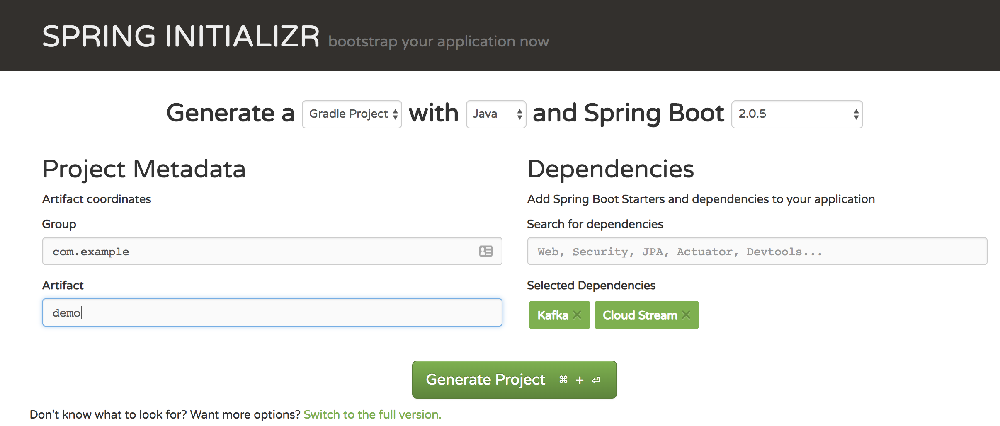

# cp-spring\_cloud\_streams-example

Very simple example to demonstrate Spring Cloud Streams (_SCS_) exchanging data with Kafka topics

The easiest way to get started is to use the [Spring Initializr](https://start.spring.io/) site. 
Set a `Group` and `Artifact` name and add `Kafka` and `Cloud Stream` as dependencies.



This generates a zip file (in my case scs_demo.zip). Unzip this and then use maven to turn it into an Eclipse project

```
mvn eclipse:eclipse
```

## Enable the Kafka Binder

_SCS_ abstracts away the mechanics of connecting to the underlying messaging system by using the concept of a _Binder_. If only a single binder is found on the class path then it will be used, but it's also possible to explicitly set which one to use by adding an `@Import` statement to the [Main Application](src/main/java/io/confluent/examples/scs_demo/ScsDemoApplication.java)

## Set up a Listener
Now lets add the simplest possible Kafka topic listener to the code.

Create a Channel definition interface which annotates a single method as an `@Input`. See [ListenerDefinition.java](src/main/java/io/confluent/examples/scs_demo/ListenerDefinition.java). This interface defines the name `input_topic` which is used in binding to the properties provided to the application. So in this example the properties `spring.cloud.stream.bindings.input_topic.*` are used by the Kafka binder to configure the actual Kafka consumer. Note that we can define multiple separate `@Input` methods if we want to have multiple bindings (for example to handle different message types).

And of course we need some code to be executed which is provided in [ListenerImpl.java](src/main/java/io/confluent/examples/scs_demo/ListenerImpl.java). The `@StreamListener(ListenerDefinition.INPUT)` annotation informs the Kafka binder that the `processRawMessage()` method should be invoked when a message is received on the `input_topic`. The _SCS_ framework is smart enough to unpack the message payload depending on the method signature as can be seen in `processDeserialised()`. 

As you can see the application code doesn't need to know any details of the actual Kafka messaging system and all configuration is isolated to the [application.properties](src/main/resources/application.properties) file. See the [SCS documentation](https://docs.spring.io/spring-cloud-stream/docs/Brooklyn.RELEASE/reference/html/_apache_kafka_binder.html) for details.

## Start ZooKeeper and Kafka
If you have docker installed then you can use the provided [docker-compose.yml](docker-compose.yml) file.

```
docker-compose up -d
```
## Run the _SCS_ application and send some data

Then run the demo application

```
mvn spring-boot:run
```	

Then send it some data using either [KafkaCat](https://github.com/edenhill/kafkacat)

```
echo "{test:\"hi\"}" | kafkacat -b localhost:9092 -t my_in_topic
```
Or the `kafka-console-producer` which is found packaged inside the ```kafka``` docker image.

```
docker-compose exec kafka kafka-console-producer --broker-list kafka:29092 --topic my_in_topic
```


You should see the message sent output in the console of your _SCS_ application like this (of course in real life you'd always output to a logger, not standard out)

```
Received message in processDeserialised(): {test:"hi"}

Received message in processRawMessage(): GenericMessage [payload=byte[11], headers={kafka_offset=3, kafka_consumer=org.apache.kafka.clients.consumer.KafkaConsumer@40cc03da, deliveryAttempt=1, kafka_timestampType=CREATE_TIME, kafka_receivedMessageKey=null, kafka_receivedPartitionId=0, kafka_receivedTopic=my_in_topic, kafka_receivedTimestamp=1539124572413, contentType=application/json}]
Payload: {test:"hi"}
```

## Shut down and clean up
Kill the _SCS_ application by using `Ctrl-C` in the console where it was started.

Stop the Kafka and ZooKeeper brokers as follows

```
docker-compose down
```
You can reclaim any space used in cycling the docker images multiple times via

```
docker volume prune -f
```
